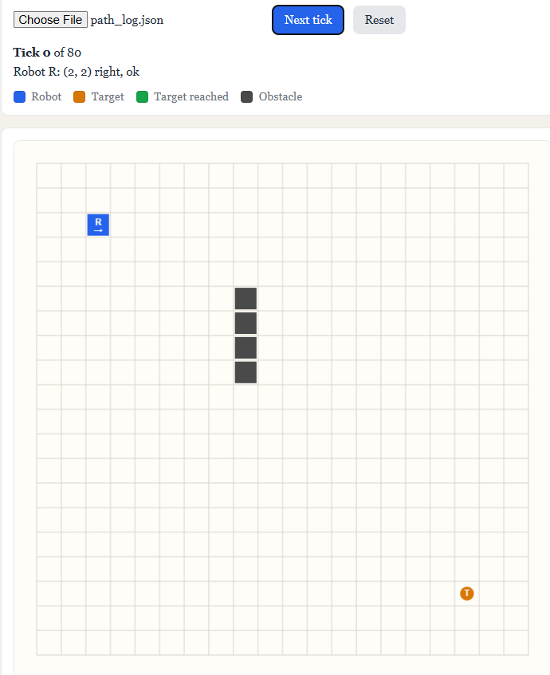
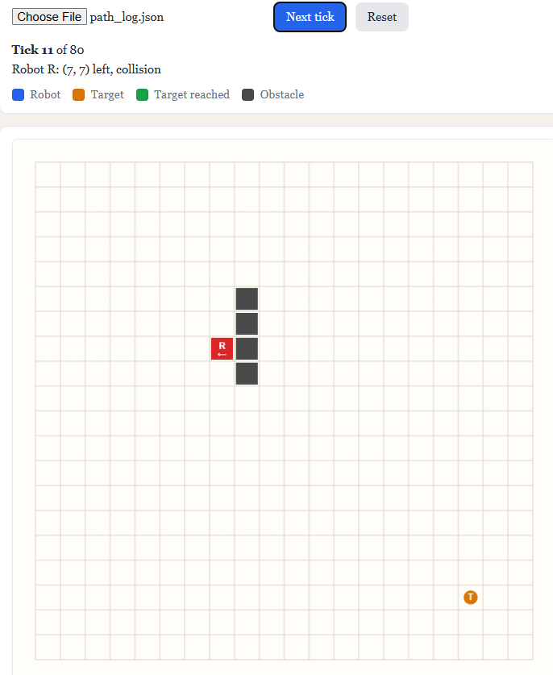
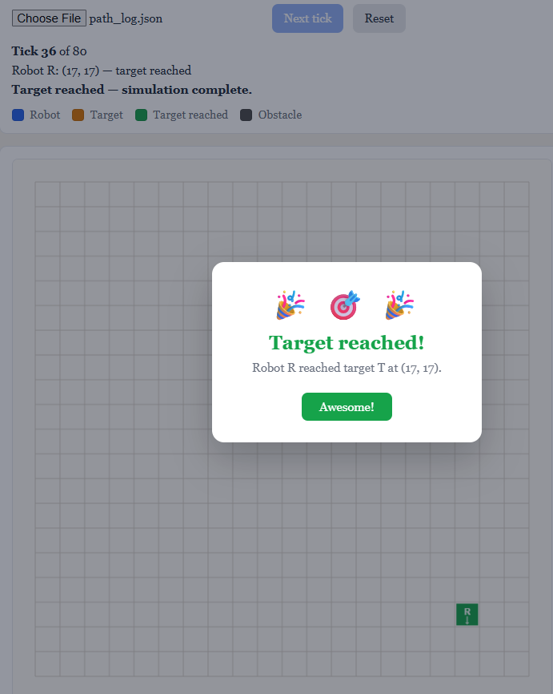

# Causis

A C++20-based domain-specific language, compiler, bytecode virtual machine, and simulation runtime for deterministic 2D grid simulations.

## Overview

causis is a C++20-based domain-specific language (DSL) and compiler for describing and executing deterministic 2D grid simulations. It provides simulation-oriented constructs such as worlds, robots, targets, obstacles, behaviors, and simulation ticks, allowing users to express grid-based behavior without implementing the underlying simulation engine themselves.

Unlike a general-purpose programming language, causis is designed around a specific domain: 2D grid simulation. Its language constructs directly represent concepts within that domain, while the compiler translates these high-level descriptions into an executable form.

A causis program passes through a complete compiler pipeline. Source code is transformed from tokens into an abstract syntax tree (AST), checked for semantic correctness, lowered into an intermediate representation (IR), optimized, and compiled into bytecode. A custom virtual machine (VM) executes the bytecode and drives the simulation runtime.

The project brings together compiler construction and simulation runtime design in a single system, demonstrating how a purpose-built language can be transformed through multiple compiler stages and ultimately used to control a deterministic simulation. The resulting simulation state can be recorded as a tick log and explored through a static 2D visualization.

```
                                           causis Source

                                                ↓

                                              Lexer

                                                ↓

                                              Parser

                                                ↓

                                               AST

                                                ↓

                                         Semantic Analysis

                                                ↓

                                               IR

                                                ↓

                                           Optimization

                                                ↓

                                             Bytecode

                                                ↓

                                        Virtual Machine(VM)

                                                ↓

                                        Simulation Runtime

                                                ↓

                                    Tick Log / 2D Visualization
```

## Why causis?

Describing grid-based simulations in a general-purpose language often involves implementation details such as grid management, entity handling, collision checking, and simulation updates.

**causis** abstracts these details into domain-specific constructs such as worlds, robots, targets, obstacles, and behaviors, allowing users to describe **what the simulation should do** rather than how the underlying engine works.

At the same time, causis provides a practical domain for exploring the complete compiler pipeline—from source code to bytecode and virtual-machine execution.

## Key features

- **Domain-Specific Language** — Provides constructs for defining 2D grid simulations.
- **Compiler Pipeline** — Transforms source code through lexing, parsing, semantic analysis, IR generation, optimization, and bytecode generation.
- **Semantic Analysis** — Validates declarations, identifiers, types, coordinates, and language rules.
- **IR Optimization** — Applies constant folding and dead-code elimination.
- **Bytecode Virtual Machine** — Executes compiled bytecode using a custom stack-based VM.
- **Simulation Runtime** — Executes deterministic grid simulations with movement, directions, targets, obstacles, collisions, and ticks.
- **Built-in Operations** — Provides movement, turning, distance, obstacle detection, and collision operations.
- **Command-Line Interface** — Provides commands for inspecting, compiling, and executing causis programs.
- **2D Visualization** — Displays recorded simulation states using HTML and Canvas.
- **Automated Testing** — Validates compiler and runtime components using GoogleTest and CTest.

## Architecture

A causis program is processed end to end through the compiler pipeline, executed by the VM against the simulation runtime, and optionally recorded for visualization.

```
                              .ls Source File

                                    ↓

                                  Lexer

                                    ↓

                                 Tokens

                                    ↓

                                 Parser

                                    ↓

                            Abstract Syntax Tree

                                    ↓

                          Semantic Analysis
                         (symbol table, checks)

                                    ↓

                            IR Generation
                               (lowering)

                                    ↓

                               Optimizer
                    (constant folding, dead-code elimination)

                                    ↓

                          Bytecode Compiler

                                    ↓

                             Bytecode Module

                                    ↓

                        Stack-based Virtual Machine

                                    ↓

                          Simulation Runtime
                    (world, robots, targets, obstacles)

                                    ↓

                              Tick Log (JSON)

                                    ↓

                    Static Visualizer (HTML / Canvas)
```

## Language overview

causis v1 is a small DSL for deterministic 2D grid simulations. Full syntax and semantics are defined in the project documentation:

- [Language specification](docs/language.md) — keywords, declarations, expressions, and built-in operations
- [Grammar](docs/grammar.md) — formal grammar for the parser
- [Semantics](docs/semantics.md) — runtime behavior, movement rules, and simulation model

Major constructs at a glance:

| Construct | Example |
|-----------|---------|
| **World** | `world 20 20;` |
| **Robot** | `robot R at 2 2;` |
| **Obstacle** | `obstacle at 8 5;` |
| **Behavior** | `behavior R { every tick { move_forward(); } }` |

Source files use the `.ls` extension. See [examples/](examples/) for complete programs.

## Complete example program

The canonical Definition-of-Done example declares a 20×20 world, places a robot and target, adds a vertical obstacle wall, and attaches navigation behavior to the robot:

```causis
world 20 20;

robot R at 2 2;
target T at 17 17;

obstacle at 8 5;
obstacle at 8 6;
obstacle at 8 7;
obstacle at 8 8;

behavior R {
    every tick {
        if obstacle_ahead() {
            turn_right();
        }

        move_toward(T);
    }
}
```

**What it does:** The program sets up a grid world with robot `R` at `(2, 2)` and target `T` at `(17, 17)`, with a column of obstacles blocking the direct path at `x = 8`. On every simulation tick, robot `R` checks whether an obstacle lies directly ahead in its current facing direction; if so, it turns right. It then attempts to move one step closer to `T` using Manhattan-distance movement. The simulation runtime applies each movement immediately and records collisions when a move is blocked.

See [examples/path_to_target.ls](examples/path_to_target.ls) for an extended version with goal detection and richer navigation.

## Compilation pipeline

Each stage transforms the program one step closer to executable simulation behavior:

| Stage | Input | Output | Role |
|-------|-------|--------|------|
| **Lexer** | Source text (`.ls`) | Token stream | Breaks source into keywords, identifiers, literals, and punctuation. |
| **Parser** | Tokens | AST | Builds a tree of declarations and statements from the token stream. |
| **Semantic analysis** | AST | Validated AST | Checks language rules: one world, unique names, in-bounds coordinates, declared-before-use, and type-correct expressions. |
| **IR generation** | AST | IR module | Lowers high-level constructs (behaviors, control flow, built-in calls) into a simpler intermediate representation. |
| **Optimizer** | IR module | IR module | Applies constant folding and dead-code elimination to remove redundant work. |
| **Bytecode compiler** | IR module | Bytecode module | Emits stack-machine instructions and operand data for the VM. |
| **Virtual machine** | Bytecode module | Runtime effects | Executes instructions each tick, calling into the simulation runtime for movement and queries. |

The CLI exposes individual stages for inspection (`tokenize`, `parse`, `semantic`, `ir`, `optimize`, `disassemble`) and runs the full pipeline with `run`.

## Simulation model

The simulation runtime is separate from the compiler. Once a program is loaded, the **world** holds all simulation state; the VM only invokes runtime operations (move, turn, query) against that world.

### World and entities

- **World** — A fixed-size 2D grid. Coordinates start at `(0, 0)` in the top-left; `x` increases right and `y` increases down.
- **Robot** — A named agent with position, facing direction (default `right`), and a per-tick collision flag.
- **Target** — A named, stationary goal cell. Robots can query distance and move toward targets; target cells are walkable.
- **Obstacle** — A static blocked cell. Robots cannot enter obstacle cells.

Each grid cell holds at most one occupying entity at declaration time. During simulation, robots move across the grid according to behavior rules.

### Tick simulation

Time advances in discrete integer **ticks**. One tick follows this order:

```
  Start tick N
       ↓
  Clear collision flags on all robots
       ↓
  For each robot (in declaration order):
    run its `every tick` behavior block
    (movements apply immediately as statements execute)
       ↓
  Increment global tick counter → tick N + 1
```

This fixed ordering makes execution **deterministic**: the same program and tick limit always produce the same sequence of world states. After each tick (or on demand), the runtime can snapshot the world into a **tick log** for the static HTML visualizer.

For full movement, collision, and built-in operation rules, see [docs/semantics.md](docs/semantics.md).

## Built-in operations

v1 provides built-in **actions** (change robot or simulation state) and **queries** (read state). All are valid only inside a robot `behavior` block.

| Operation | Kind | Returns | Description |
|-----------|------|---------|-------------|
| `move_up()` | Action | — | Move one cell up (decrease `y`). |
| `move_down()` | Action | — | Move one cell down (increase `y`). |
| `move_left()` | Action | — | Move one cell left (decrease `x`). |
| `move_right()` | Action | — | Move one cell right (increase `x`). |
| `move_forward()` | Action | — | Move one cell in the robot's current facing direction. |
| `move_toward(T)` | Action | — | Move one Manhattan step closer to target `T`. |
| `turn_left()` | Action | — | Rotate the robot 90° counter-clockwise. |
| `turn_right()` | Action | — | Rotate the robot 90° clockwise. |
| `stop()` | Action | — | End the current robot's behavior for this tick (skip remaining statements). |
| `distance_to(T)` | Query | `int` | Manhattan distance from the robot to target `T`. |
| `obstacle_ahead()` | Query | `bool` | `true` if an obstacle lies directly ahead in the robot's facing direction. |
| `collision()` | Query | `bool` | `true` if the robot recorded a failed movement during the current tick. |

Failed movement does not change position and sets the robot's collision flag for that tick.

## CLI usage

Start with help:

```sh
./build/causis.exe --help
```

| Command | Purpose |
|---------|---------|
| `causis tokenize <file.ls>` | Print the token stream |
| `causis parse <file.ls>` | Print the AST |
| `causis semantic <file.ls>` | Run semantic analysis only |
| `causis ir <file.ls>` | Print lowered IR |
| `causis optimize <file.ls>` | Print IR after optimization |
| `causis disassemble <file.ls>` | Print bytecode disassembly |
| `causis run <file.ls> [--ticks N] [--log path.json]` | Compile and execute (default: 10 ticks) |

On Windows PowerShell, use `.\build\causis.exe` instead of `./build/causis.exe`.

## Visualization

Run a simulation with tick logging, then step through frames in the browser:

```sh
./build/causis.exe run examples/path_to_target.ls --ticks 80 --log build/path_log.json
```

Open [visualizer/index.html](visualizer/index.html), load the JSON file, and use **Next tick** to advance. When the robot reaches the target, it turns green, stepping stops, and a celebration popup appears.

The simulation output can be viewed using the static 2D visualizer.






## Project structure

```
causis/
├── CMakeLists.txt          # Build configuration and test targets
├── README.md
├── docs/                   # Canonical language specs
│   ├── language.md
│   ├── grammar.md
│   └── semantics.md
├── examples/               # Sample .ls programs
├── include/                # Public headers (one subdir per compiler stage)
│   ├── ast/
│   ├── bytecode/
│   ├── cli/
│   ├── ir/
│   ├── lexer/
│   ├── parser/
│   ├── runtime/
│   ├── semantic/
│   └── vm/
├── src/                    # Implementations (mirrors include/)
│   ├── ast/
│   ├── bytecode/
│   ├── cli/
│   ├── ir/
│   ├── lexer/
│   ├── parser/
│   ├── runtime/
│   ├── semantic/
│   ├── vm/
│   └── main.cpp            # CLI entry point
├── tests/                  # GoogleTest unit tests per stage
│   ├── bytecode/
│   ├── cli/
│   ├── ir/
│   ├── lexer/
│   ├── parser/
│   ├── runtime/
│   ├── semantic/
│   └── vm/
├── visualizer/             # Static HTML/Canvas tick-log viewer
│   └── index.html
└── build/                  # Local build output (created by CMake, not committed)
```

| Directory | Role |
|-----------|------|
| `docs/` | Authoritative v1 language, grammar, and semantics specifications |
| `include/` / `src/` | Compiler pipeline (lexer → parser → semantic → IR → bytecode → VM) and simulation runtime |
| `examples/` | Small programs demonstrating language features end to end |
| `tests/` | Stage-level unit tests plus CLI integration tests registered in CMake |
| `visualizer/` | Decoupled frontend that reads tick-log JSON produced by `causis run --log` |

## Build the project

### Prerequisites

- **MSYS2** with the **UCRT64** environment (recommended on Windows)
- **CMake** 3.20+
- **Ninja** build system
- **GCC** (C++20)

In the **MSYS2 UCRT64** terminal, install toolchain packages if needed:

```sh
pacman -S --needed mingw-w64-ucrt-x86_64-gcc mingw-w64-ucrt-x86_64-cmake mingw-w64-ucrt-x86_64-ninja
```

### Configure and build

From the project root (inside **MSYS2 UCRT64**):

```sh
cd /c/Users/You/path/to/causis
cmake -S . -B build -G Ninja
cmake --build build
```

If `build/` was previously configured with a different generator, remove it first:

```sh
rm -rf build
cmake -S . -B build -G Ninja
cmake --build build
```

### Build from PowerShell (optional)

Prefix PATH for one session so `cmake`, `g++`, and `ninja` resolve to the MSYS2 UCRT64 toolchain:

```powershell
cd C:\Users\You\path\to\causis
$env:PATH = "C:\msys64\ucrt64\bin;C:\msys64\usr\bin;" + $env:PATH
cmake -S . -B build -G Ninja
cmake --build build
```

Adjust `C:\msys64` if MSYS2 is installed elsewhere.

### Verify the binary

```sh
./build/causis.exe --help
```

You should see usage for `tokenize`, `parse`, `semantic`, `ir`, `optimize`, `disassemble`, and `run`.

## Running examples

These are the canonical example programs:

```sh
./build/causis.exe run examples/basic_move.ls
./build/causis.exe run examples/collision.ls
./build/causis.exe run examples/target.ls
```

| Example | What it demonstrates |
|---------|----------------------|
| `basic_move.ls` | Minimal program: one robot moves right every tick on a small grid. |
| `collision.ls` | Obstacle avoidance: the robot turns when `obstacle_ahead()` is true, otherwise moves forward. |
| `target.ls` | Goal-directed movement: the robot uses `move_toward(T)` each tick to approach a named target. |

Add `--ticks N` to control simulation length (default is 10). For the full pathfinding demo, see `examples/path_to_target.ls`.

## Testing

After building, run the full test suite from the project root:

```sh
ctest --test-dir build --output-on-failure
```

This runs GoogleTest unit tests and CMake integration tests that invoke the `causis` CLI against the example programs.

| Category | Location | What is verified |
|----------|----------|------------------|
| **Lexer tests** | `tests/lexer/` | Tokenization of keywords, identifiers, literals, and comments |
| **Parser tests** | `tests/parser/` | AST construction from valid and invalid syntax |
| **Semantic tests** | `tests/semantic/` | World/entity rules, scopes, types, and built-in call validation |
| **IR tests** | `tests/ir/` | Lowering from AST to IR |
| **Optimizer tests** | `tests/ir/optimizer_test.cpp` | Constant folding and dead-code elimination |
| **Bytecode tests** | `tests/bytecode/` | Instruction emission and disassembly |
| **VM tests** | `tests/vm/` | Stack-machine execution, tick limits, and `stop()` behavior |
| **Runtime tests** | `tests/runtime/` | World movement, collisions, program runner, and tick-log export |
| **Integration tests** | `CMakeLists.txt` (`add_test`) | End-to-end CLI commands on `examples/basic_move.ls` and related programs |

## Error handling

Compiler and frontend errors are reported with the failing **stage**, a **message**, and **line/column** when available. Richer diagnostics (source line excerpt, caret indicator, and a short explanation) are a future improvement.

Example semantic error (referencing an undeclared target):

```
Semantic error

unknown target 'T2'

 4 |         move_toward(T2);
                      ^^
```

Error categories:

| Category | Stage | Typical causes |
|----------|-------|----------------|
| **Lexical errors** | Lexer | Invalid characters, unterminated tokens |
| **Syntax errors** | Parser | Missing semicolons, mismatched braces, malformed declarations |
| **Semantic errors** | Semantic analysis | Unknown identifiers, duplicate declarations, out-of-bounds coordinates, type mismatches |
| **Runtime errors** | VM / runtime | I/O failures, invalid simulation state (rare in v1) |

## Design decisions / technical highlights

**Why a DSL?**  
Simulation concepts (world, robot, target, obstacle, tick) are first-class in the language instead of being rebuilt in a general-purpose language for every program.

**Why an AST?**  
Parsing produces a structured tree that separates concrete syntax from later compiler stages. Semantic analysis, lowering, and optimization all work on the AST (or structures derived from it) rather than raw text.

**Why IR?**  
The intermediate representation creates a clean boundary between the frontend (parsing and checking) and backend (optimization and bytecode generation). High-level behavior blocks lower into simpler instructions the VM can execute.

**Why a bytecode VM?**  
Bytecode demonstrates compilation into an executable intermediate format. The stack-based VM dispatches opcodes each tick and delegates simulation effects to the runtime.

**Why deterministic execution?**  
Fixed tick order, immediate movement application, and robot execution order mean the same program and tick limit always produce the same world states—essential for debugging, testing, and reproducible tick logs.

**Why minimal optimization?**  
Only constant folding and dead-code elimination are included. The goal is an understandable compiler architecture, not a large optimization framework.

**Why static visualization?**  
The HTML visualizer reads a tick-log JSON file produced offline by `causis run --log`. Visualization stays decoupled from VM execution while still making every simulation step observable.

## Limitations (v1)

v1 is intentionally small. Out of scope:

- Integers and booleans only
- No strings or floats
- No user-defined functions
- No arrays or maps
- No randomness
- No concurrency
- No networking
- 2D grid only (no 3D)
- No physics engine
- No built-in pathfinding (BFS/A*)
- Static visualization only
- One world per program
- Line comments only

See [docs/language.md](docs/language.md) §19 for the full out-of-scope list.

## Future work

Not implemented in the current release:

- LLM natural-language-to-DSL frontend
- Live run/pause/speed controls in the visualizer
- Compiler pipeline visualization (multi-pane IR/bytecode view)
- BFS/A* pathfinding builtins or library
- Richer visualization (styling, animation, multiple robots highlighted)
- Additional IR optimizations (unreachable-behavior elimination, bounds checks)
- Performance benchmarking and profiling tools
- Larger-world stress scenarios and scalability experiments

These remain stretch goals rather than committed milestones.

## Learning and academic context

causis is structured as a coursework-scale compiler plus runtime project. It touches several standard CS topics in one cohesive codebase.

**Compiler construction** — Lexical analysis and tokenization; context-free syntax analysis; AST construction; semantic analysis and symbol rules; IR lowering; peephole-style optimization; bytecode generation; stack-based virtual machine design.

**Runtime systems** — Stack-machine instruction dispatch; host runtime callbacks for simulation builtins; deterministic tick scheduling; collision and movement semantics; tick-log recording for offline inspection.

**Software engineering** — C++20 with clear module boundaries; CMake build and test integration; GoogleTest/CTest at each pipeline stage; shared CLI frontend loader; separation of compiler, VM, runtime, and visualizer.

Together, these areas support explaining the project in a viva or technical interview: from source text through compilation to observable simulation output.

## Documentation

| Document | Path | Contents |
|----------|------|----------|
| Language specification (v1) | [docs/language.md](docs/language.md) | Syntax, keywords, declarations, expressions, built-ins |
| Formal grammar | [docs/grammar.md](docs/grammar.md) | Parser grammar for causis v1 |
| Semantics | [docs/semantics.md](docs/semantics.md) | Runtime rules, movement, ticks, simulation model |

The `docs/` directory is the canonical source for v1 syntax and semantics.

